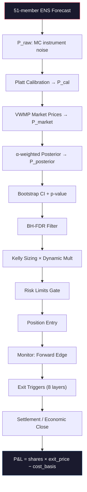

# Zeus 全数学彻查：仓位生命周期端到端审计

从一个仓位被选中到退出/结算的完整数学流水线追踪。

---

## 总览：数学流水线



---

## Phase 1: Signal Generation — P_raw

### 1.1 Ensemble Signal (DayN path)

**Source**: [ensemble_signal.py](file:///Users/leofitz/.openclaw/workspace-venus/zeus/src/signal/ensemble_signal.py)

**Input**: 51 ECMWF ENS members, hourly forecasts, shape `(n_members, hours)`

**Step 1 — Extract daily max per member:**
```
member_maxes[m] = max(members_hourly[m, tz_hours])
```
where `tz_hours` = indices whose UTC timestamps fall on `target_date` in the city's local timezone.

**Step 2 — Optional bias correction** (gated by `bias_correction_enabled`):
```
member_maxes -= bias × discount_factor
```
where `bias = mean(forecast − actual)` from `model_bias` table, requiring `n_samples ≥ 20`.

**Step 3 — Settlement rounding:**
```
member_maxes_settled = SettlementSemantics.round_values(member_maxes)
```

**Step 4 — Monte Carlo P_raw** (`n_mc` iterations, default from config):

For each MC iteration:
```python
noised = member_maxes + ε,    ε ~ N(0, σ_instrument²)
measured = round(noised)       # settlement rounding
p[bin_i] += count(measured ∈ bin_i)
```

σ_instrument:
- °F cities: `ensemble_instrument_noise("F")` (≈ 0.5°F, ASOS sensor precision)
- °C cities: independently calibrated (NOT °F/1.8)

Final normalization:
```
P_raw = p / (n_members × n_mc)
P_raw = P_raw / sum(P_raw)    # enforce Σ = 1.0
```

### 1.2 Day0 Signal (Settlement-day path)

**Source**: [day0_signal.py](file:///Users/leofitz/.openclaw/workspace-venus/zeus/src/signal/day0_signal.py)

**Key insight**: Observed daily high is a **hard floor**. `final = max(obs_high, remaining_ens)`.

**Sigma computation** (post-peak aware):
```
σ_day0 = max(quant_floor, base_sigma × peak_shrinkage × staleness_expansion)
```
where:
- `quant_floor` = 0.35°F / 0.20°C (absorbs integer rounding noise, `√(1²/12) ≈ 0.29`)
- `peak_shrinkage = 1.0 − peak_confidence × 0.5`
- `staleness_expansion = 1.0 + (1.0 − freshness) × 0.5`
- `freshness = max(0, 1.0 − age_hours / 3.0)`

**Observation weight** (continuous 0→1):
```
w_obs = max(time_closure, 0.75 × peak_signal, 0.50 × daylight_signal, 0.35 × ens_signal)
```
With overrides:
- pre-sunrise: `min(w, 0.05)` — observation nearly irrelevant
- post-sunset AND trusted+fresh source: `w = 1.0` — observation is finality

**Day0 MC loop**:
```python
backbone = observed_high + residual_adjustment
blended = backbone + max(0, remaining_ens − backbone) × (1 − w_obs)
final_settled = round(blended)
```

> [!IMPORTANT]
> The backbone residual adjustment is currently a Phase-1 seam returning near-zero values. The actual Day0 signal is dominated by `max(obs_high, ens_remaining) × (1 − w_obs)` blending.

---

## Phase 2: Platt Calibration — P_cal

**Source**: [platt.py](file:///Users/leofitz/.openclaw/workspace-venus/zeus/src/calibration/platt.py)

### 2.1 Model

Extended Platt Scaling with lead_days as input feature:

```
P_cal = sigmoid(A × logit(P_raw) + B × lead_days + C)
```

where `logit(p) = log(p / (1−p))`, input clamped to `[0.01, 0.99]`.

### 2.2 Training

Fitted via `sklearn.LogisticRegression`:
- Feature matrix `X = [logit(P_raw), lead_days]`
- Target: binary settlement outcomes `y ∈ {0, 1}`
- Regularization C: 1.0 for n≥50, 0.1 for 15≤n<50, no fit for n<15

**Width-aware normalization** (optional): for finite bins, Platt sees `P_raw / bin_width` (density) instead of raw probability mass. Shoulder bins kept in raw space.

### 2.3 Bootstrap parameter uncertainty

200 bootstrap parameter sets `(A_i, B_i, C_i)` for later double-bootstrap CI. Without these, edge CI is systematically too narrow → overtrading.

### 2.4 Post-calibration normalization

```python
p_cal = [calibrator.predict_for_bin(p, lead_days, bin_width=w) for p, w in zip(P_raw, widths)]
p_cal = p_cal / sum(p_cal)     # re-normalize to Σ = 1.0
```

> [!NOTE]
> Platt is trained per-bin independently (not jointly). After independent calibration, the vector does not naturally sum to 1.0, so re-normalization is mandatory.

---

## Phase 3: Market Prices — P_market

**Source**: [market_fusion.py](file:///Users/leofitz/.openclaw/workspace-venus/zeus/src/strategy/market_fusion.py)

### 3.1 VWMP (Volume-Weighted Micro-Price)

For each bin's token:
```
P_market[i] = VWMP = (best_bid × ask_size + best_ask × bid_size) / (bid_size + ask_size)
```

Fallback if `total_size = 0`: mid-price `(bid + ask) / 2` + warning log.

> [!WARNING]
> P_market sums to vig (~0.95–1.05), **not** 1.0. The posterior blend must be re-normalized.

---

## Phase 4: Model Agreement (ECMWF vs GFS)

**Source**: [model_agreement.py](file:///Users/leofitz/.openclaw/workspace-venus/zeus/src/signal/model_agreement.py)

```
JSD = jensenshannon(ecmwf_p, gfs_p)²    # squared to recover true JSD
mode_gap = |argmax(ecmwf_p) − argmax(gfs_p)|
```

| JSD | Mode Gap | Verdict |
|-----|----------|---------|
| < 0.02 | ≤ 1 | `AGREE` |
| < 0.08 | any, OR any + gap ≤ 1 | `SOFT_DISAGREE` |
| otherwise | | `CONFLICT` → skip market |

> [!IMPORTANT]
> GFS is **NEVER** blended into probability. It's conflict detection only. KL divergence is explicitly forbidden (asymmetric).

---

## Phase 5: Alpha Computation

**Source**: [market_fusion.py](file:///Users/leofitz/.openclaw/workspace-venus/zeus/src/strategy/market_fusion.py#L54-L124)

α determines model-vs-market trust. Higher α → trust model more.

```
α = BASE_ALPHA[calibration_level]
    + spread_adjustment
    + agreement_adjustment
    + lead_adjustment
    + freshness_adjustment
```

Clamped to `[0.20, 0.85]`.

| Factor | Condition | Δα |
|--------|-----------|-----|
| **Base** (cal level 1–4) | config values | e.g. 0.55/0.65/0.70/0.75 |
| Spread tight | `spread < SPREAD_TIGHT` | +0.10 |
| Spread wide | `spread > SPREAD_WIDE` | −0.15 |
| Soft disagree | | −0.10 |
| Conflict | | −0.20 (market skipped before this) |
| Short lead | `lead_days ≤ 1` | +0.05 |
| Long lead | `lead_days ≥ 5` | −0.05 |
| Fresh market | `hours_open < 12` | +0.10 |
| Very fresh | `hours_open < 6` | +0.05 (cumulative) |

Spread thresholds are **unit-typed** (`TemperatureDelta`) — prevents the documented "Rainstorm bug" where 2.0 was used for both °F and °C.

---

## Phase 6: Posterior Blending

**Source**: [market_fusion.py](file:///Users/leofitz/.openclaw/workspace-venus/zeus/src/strategy/market_fusion.py#L175-L215)

```
P_posterior = normalize(α_vec × P_cal + (1 − α_vec) × P_market)
```

**Per-bin α scaling** (D3 analysis):
- Tail bins (shoulder bins: "X or below", "X or higher") get `α_tail = max(0.20, α × 0.5)`
- Rationale: tail bins are 5.3× harder for the model (Brier 0.67 vs 0.11)
- This gave Brier improvement of −0.042 vs uniform α

---

## Phase 7: Edge Detection + Bootstrap CI

**Source**: [market_analysis.py](file:///Users/leofitz/.openclaw/workspace-venus/zeus/src/strategy/market_analysis.py)

### 7.1 Edge computation

For each bin, two directions tested:
```
edge_yes[i] = P_posterior[i] − P_market[i]
edge_no[i]  = (1 − P_posterior[i]) − (1 − P_market[i])
```

### 7.2 Double bootstrap CI

Three σ sources captured simultaneously:

| Layer | Source | Method |
|-------|--------|--------|
| σ_ensemble | ENS member resampling | `rng.choice(members, n, replace=True)` |
| σ_instrument | Sensor noise | `+ N(0, σ_analysis²)` |
| σ_parameter | Platt uncertainty | Sample from bootstrap `(A_i, B_i, C_i)` |

**σ_analysis** (forecast-uncertainty seam):
```
σ_analysis = σ_instrument × lead_multiplier × spread_multiplier
lead_multiplier = 1.0 + 0.2 × (lead_days / 6.0)    # 1.0 at day0 → 1.2 at day6
spread_multiplier = 1.0 + 0.1 × ratio               # ratio = min(1, spread / (4 × σ_instrument))
```

Per bootstrap iteration:
```python
sample = resample(members)
noised = sample + N(0, σ_analysis)
measured = round(noised)
p_raw_boot = count(measured ∈ bin) / n

if has_platt:
    (A, B, C) = random_platt_params
    p_cal_boot = sigmoid(A × logit(p_raw_boot) + B × lead_days + C)
else:
    p_cal_boot = p_raw_boot

p_post = α × p_cal_boot + (1−α) × P_market[i]
edge_boot = p_post − P_market[i]
```

**CI extraction**:
```
ci_lower = percentile(edges, 5)     # 90% CI
ci_upper = percentile(edges, 95)
p_value = mean(edges ≤ 0)          # EXACT, not approximated
```

**Gate**: Only edges with `ci_lower > 0` proceed.

### 7.3 Mean offset (forecast-layer seam)

```
member_maxes_analysis = member_maxes + offset
```
where `offset` = bias-correction seam:
```
raw_offset = −bias × discount × lead_factor × sample_factor × mae_factor
offset = clamp(raw_offset, ±2 × σ_instrument)
```
- `sample_factor = 0` if `n_samples < 20`
- `mae_factor` linearly decays from 1.0 to 0.0 as MAE goes from σ to 4σ

---

## Phase 8: FDR Filter (Benjamini-Hochberg)

**Source**: [fdr_filter.py](file:///Users/leofitz/.openclaw/workspace-venus/zeus/src/strategy/fdr_filter.py)

Controls false discovery rate across ~220 simultaneous hypotheses (10 cities × 11 bins × 2 directions).

```
Sort edges by p_value ascending.
Find largest k where: p_value[k] ≤ fdr_alpha × k / m
Accept edges 1..k.
```

Default `fdr_alpha` from config (typically 0.10).

---

## Phase 9: Kelly Sizing

**Source**: [kelly.py](file:///Users/leofitz/.openclaw/workspace-venus/zeus/src/strategy/kelly.py)

### 9.1 Base Kelly fraction

```
f* = (P_posterior − entry_price) / (1 − entry_price)
size = f* × kelly_mult × bankroll
```

Returns 0 if `P_posterior ≤ entry_price` or `entry_price ≥ 1.0`.

### 9.2 Dynamic Kelly multiplier

Starting from `base` (config, typically 0.25), multiplicative reductions:

| Condition | Multiplier |
|-----------|-----------|
| CI width > 0.10 | × 0.7 |
| CI width > 0.15 | × 0.5 (cumulative) |
| Lead ≥ 5 days | × 0.6 |
| Lead ≥ 3 days | × 0.8 |
| Win rate < 0.40 | × 0.5 |
| Win rate < 0.45 | × 0.7 |
| Heat > 0.40 | × max(0.1, 1 − heat) |
| Drawdown | × max(0, 1 − dd/max_dd) |

### 9.3 Regime throttling (Phase 3 RiskGraph)

```python
risk_throttle = 1.0
if cluster_exposure > 0.10:    risk_throttle *= 0.5
if portfolio_heat > 0.25:      risk_throttle *= 0.5
```

Final size:
```
size = kelly_size(p_posterior, entry_price, bankroll, km × risk_throttle)
size *= policy.allocation_multiplier
```

If `policy.threshold_multiplier > 1.0`:
```
km = km / policy.threshold_multiplier    # tightens the equivalent edge threshold
```

---

## Phase 10: Risk Limits Gate

**Source**: [risk_limits.py](file:///Users/leofitz/.openclaw/workspace-venus/zeus/src/strategy/risk_limits.py)

Hard caps checked in order:

| Limit | Check |
|-------|-------|
| Minimum order | `size < min_order_usd` → reject |
| Single position | `size / bankroll > max_single_position_pct` → reject |
| Portfolio heat | `(current_heat + new_pct) > max_portfolio_heat_pct` → reject |
| City concentration | `(city_exposure + new_pct) > max_city_pct` → reject |
| Cluster concentration | `(cluster_exposure + new_pct) > max_region_pct` → reject |

Exposure functions use `size_usd / bankroll` for all active positions (excluding `INACTIVE_RUNTIME_STATES`).

---

## Phase 11: Anti-Churn Defense (Layers 5–7)

**Source**: [portfolio.py](file:///Users/leofitz/.openclaw/workspace-venus/zeus/src/state/portfolio.py#L1195-L1235)

| Layer | Check | Cooldown |
|-------|-------|----------|
| 5 | Reentry block: same (city, bin, date) recently exited via reversal | 20 minutes |
| 6 | Token cooldown: voided tokens (UNFILLED_ORDER, EXIT_FAILED) | 1 hour |
| 7 | Cross-date block: same (city, bin) already open on different date | Always |

---

## Phase 12: Position Entry

After all gates pass, position is created with:
- `entry_price` = VWMP (native space: YES price for buy_yes, NO price for buy_no)
- `p_posterior` = posterior probability (native space)
- `shares = size_usd / entry_price`
- `cost_basis_usd = size_usd`
- `edge = p_posterior − entry_price`
- `entry_ci_width = ci_upper − ci_lower` (persisted for exit threshold scaling)

---

## Phase 13: Exit Evaluation — Forward Edge + 8-Layer Defense

**Sources**: [exit_triggers.py](file:///Users/leofitz/.openclaw/workspace-venus/zeus/src/execution/exit_triggers.py), [portfolio.py](file:///Users/leofitz/.openclaw/workspace-venus/zeus/src/state/portfolio.py#L267-L613)

### 13.1 Forward edge computation

```
forward_edge = compute_forward_edge(
    HeldSideProbability(fresh_prob, direction),
    NativeSidePrice(current_market_price, direction),
)
```

Conservative evidence edge:
```
evidence_edge = forward_edge − max(0, ci_width) / 2.0
```

### 13.2 Exit trigger cascade (priority order)

| Priority | Trigger | Condition | Urgency |
|----------|---------|-----------|---------|
| 1 | `SETTLEMENT_IMMINENT` | `hours_to_settlement < 1.0` | immediate |
| 2 | `WHALE_TOXICITY` | Adjacent bin sweep detected | immediate |
| 3 | `MODEL_DIVERGENCE_PANIC` | `divergence_score ≥ hard_threshold` | immediate |
| 3b | `MODEL_DIVERGENCE_PANIC` | `div ≥ soft_threshold AND velocity ≤ velocity_confirm` | immediate |
| 3c | `FLASH_CRASH_PANIC` | `market_velocity_1h ≤ −0.15` | immediate |
| 4 | **Micro-position hold** | `size_usd < $1.00` → never sell | — |
| 5 | `VIG_EXTREME` | `vig > 1.08 OR vig < 0.92` | normal |
| 6 | Direction-specific exit | See below | normal |

### 13.3 Buy-yes exit path

```
edge_threshold = −|entry_ci_width| × scaling_factor
                  clamped to [floor, ceiling]

if evidence_edge ≥ threshold:
    neg_edge_count = 0    # reset
    → HOLD

neg_edge_count += 1
if neg_edge_count < consecutive_confirmations (default 2):
    → HOLD (need 2 consecutive negative cycles)

# EV gate (Layer 4)
if shares × best_bid ≤ shares × p_posterior:
    → HOLD (selling worse than expected settlement)

→ EXIT: EDGE_REVERSAL
```

### 13.4 Buy-no exit path

Different math entirely — buy_no has ~87.5% base win rate.

**Near settlement** (`hours < near_settlement_hours`):
```
if forward_edge < buy_no_ceiling:
    → EXIT: BUY_NO_NEAR_EXIT
else:
    → HOLD (ride to settlement unless deeply negative)
```

**Normal path**: same consecutive-cycle mechanism as buy_yes, with:
- `buy_no_edge_threshold` (different scaling factor, floor, ceiling)
- EV gate: `shares × market_price ≤ shares × p_posterior` → HOLD

---

## Phase 14: Exit Execution

**Source**: [exit_lifecycle.py](file:///Users/leofitz/.openclaw/workspace-venus/zeus/src/execution/exit_lifecycle.py)

### 14.1 Paper mode
```
economic_close(portfolio, trade_id, current_market_price, reason)
```

### 14.2 Live mode — State machine:
```
"" → exit_intent → sell_placed → sell_pending → sell_filled (economically_closed)
                  ↘ retry_pending → (back to "" after cooldown)
                  → backoff_exhausted (hold to settlement)
```

**Retry with exponential backoff**:
```
cooldown = min(300 × 2^(retry_count − 1), 3600)   # 5min → 10min → 20min → ... → 60min cap
```
Max retries: 10. After exhaustion → hold to settlement.

**Fill price extraction priority**:
1. `sell_result.fill_price`
2. `sell_result["avgPrice"]` / `["avg_price"]` / `["price"]`
3. `best_bid`
4. `current_market_price`

---

## Phase 15: Settlement & P&L

**Source**: [harvester.py](file:///Users/leofitz/.openclaw/workspace-venus/zeus/src/execution/harvester.py), [portfolio.py](file:///Users/leofitz/.openclaw/workspace-venus/zeus/src/state/portfolio.py#L932-L995)

### 15.1 Settlement detection

Polls Gamma API for `closed=true` temperature events. Determines winning bin via:
1. `market["winningOutcome"] == "Yes"` (primary)
2. `outcomePrices[0] >= 0.95` (fallback)

### 15.2 P&L computation

```python
won = (position.bin_label == winning_label)
shares = size_usd / entry_price

# Direction-correct exit price
if direction == "buy_yes":
    exit_price = 1.0 if won else 0.0
else:  # buy_no
    exit_price = 1.0 if NOT won else 0.0
```

**Realized P&L**:
```
PnL = shares × exit_price − cost_basis_usd
    = (size_usd / entry_price) × exit_price − size_usd
```

Special case: if position was already `economically_closed` (sold before settlement):
```
settlement_price = pos.exit_price    # use the sell fill price, not 0/1
```

### 15.3 Calibration pair generation

For each settled market, per-bin:
```python
add_calibration_pair(
    p_raw = decision_time_p_raw[i],
    outcome = 1 if label == winning_label else 0,
    lead_days = snapshot_lead_days,
)
```

Uses **decision-time snapshots** (from `ensemble_snapshots`), not current data. Prefers durable settlement truth over open portfolio fallback.

After calibration pairs are created: `maybe_refit_bucket()` triggers Platt recalibration if enough new data exists.

### 15.4 Live redemption

For winning positions in live mode: `clob.redeem(condition_id)` claims USDC on-chain.

---

## 已识别的数学观察与潜在问题

### ✅ 已验证正确

1. **P_raw 归一化**: MC counts → divide by `(n_members × n_mc)` → re-normalize to Σ=1. Correct.
2. **Platt input clamping**: `[0.01, 0.99]` prevents `log(0)`. Correct.
3. **VWMP**: Volume-weighted, not naive mid-price. Correct per spec.
4. **FDR**: Standard Benjamini-Hochberg. p-values are empirical bootstrap, not approximated. Correct.
5. **Kelly**: `f* = (p − price) / (1 − price)` is the correct binary Kelly formula for cost-per-share markets.
6. **Direction invariant**: P_posterior and entry_price are ALWAYS in native space (buy_yes→P(YES), buy_no→P(NO)). Flipped exactly once at creation. Verified throughout.
7. **Settlement P&L**: `shares × exit_price − cost_basis` is correct for binary markets.

### ⚠️ 需要关注的观察

| # | Area | Observation | Severity |
|---|------|-------------|----------|
| O-1 | Bootstrap buy_no | `_bootstrap_bin_no` computes `p_post_no = 1 − (α × p_cal_boot + (1−α) × p_market)` which is algebraically correct BUT does not apply tail-α scaling (uses global α for the bin, not the per-bin `alpha_vec` from `compute_posterior`). The point estimate uses tail scaling, but the CI does not. | **Medium** — CI may be too narrow for shoulder-bin NO edges |
| O-2 | Bootstrap sigma | `σ_analysis` uses `σ_instrument` as its base, but the ENS members were already bias-corrected. The bootstrap resamples from corrected members and adds noise based on instrument σ — this is correct since bias correction shifts the mean but doesn't change the noise model. | Low |
| O-3 | Dynamic Kelly | `rolling_win_rate_20` and `drawdown_pct` are default (0.5, 0.0) in the evaluator call — these dynamic multiplier axes are **inactive**. Only `ci_width`, `lead_days`, and `portfolio_heat` actually attenuate sizing. | **Medium** — documented feature not wired |
| O-4 | Economic close before settlement | If a position is sold (`economically_closed`) and then settles, `settlement_price = pos.exit_price` (the sell price), and P&L is NOT recomputed. This means if you sold at 0.40 and the market settles at 1.0, the P&L reflects the sell, not the settlement outcome. This is **intentional** (economic close is authoritative). | Design decision — correct |
| O-5 | Regime throttle thresholds | Cluster saturation at 10% and heat saturation at 25% are hardcoded in evaluator, not in config. These should arguably live in `risk_limits.py` or settings. | Low — hardcoded but functional |
| O-6 | Day0 backbone residual | The backbone residual adjustment is currently near-zero (all factors multiply to a small value). The entire Day0 signal effectively reduces to `max(obs, ens_remaining × (1−w_obs))` with a thin noise layer. This is conservative but means the Phase-1 seam adds complexity without meaningful behavior change yet. | Low — intentional seam |

### 🔴 发现的问题

| # | Area | Issue | Impact |
|---|------|-------|--------|
| I-1 | Bootstrap CI symmetry | The bootstrap for buy_yes uses `α × p_cal_boot + (1−α) × P_market[bin_idx]` (global α), but the point estimate `p_posterior` was computed with **per-bin tail-scaled α**. This means the CI is centered around a slightly different α-blend than the point estimate for tail bins. | May produce slightly misaligned CI for shoulder bins |
| I-2 | `_forecast_source_key` | Maps any model name starting with "openmeteo" to "openmeteo", but Open-Meteo can serve multiple upstream models. If the system ever uses Open-Meteo API for ECMWF data, the bias lookup would key on "openmeteo" instead of "ecmwf". | Edge case — only matters if Open-Meteo is used as ECMWF proxy |

---

## 数学常量汇总表

| Constant | Value | Source | Purpose |
|----------|-------|--------|---------|
| σ_instrument (°F) | config `ensemble_instrument_noise("F")` | ASOS calibration | MC noise |
| σ_instrument (°C) | config `ensemble_instrument_noise("C")` | Independent calibration | MC noise |
| Quant noise floor (°F) | 0.35 | `√(1²/12) + sensor ≈ 0.31, margin → 0.35` | Day0 sigma floor |
| Quant noise floor (°C) | 0.20 | Scaled from °F | Day0 sigma floor |
| Peak shrinkage | 0.50 | MATH-005 review | Day0 sigma |
| Staleness expansion | 0.50 | MATH-005, 3h stale → 50% | Day0 sigma |
| Platt clamp | [0.01, 0.99] | Prevents log(0) | Calibration |
| Bootstrap N (Platt) | config `calibration_n_bootstrap` (200) | Spec §3.1 | Parameter uncertainty |
| Bootstrap N (edge) | config `edge_n_bootstrap` | Spec §4.1 | Edge CI |
| FDR α | config `edge.fdr_alpha` (0.10) | Spec §4.4 | Discovery rate |
| α clamp | [0.20, 0.85] | Spec §4.5 | Model trust bounds |
| Tail α scale | 0.50 | D3 analysis sweep | Shoulder bin weighting |
| JSD agree | 0.02 | Spec §2.2 | Model agreement |
| JSD soft disagree | 0.08 | Spec §2.2 | Model agreement |
| Mode gap conflict | 2 bins | Spec §2.2 | Model agreement |
| Kelly base | config `sizing.kelly_multiplier` (0.25) | Spec §5.1 | Fractional Kelly |
| Consecutive confirms | config (default 2) | Anti-churn | Exit delay |
| Reentry block | 20 min | Anti-churn Layer 5 | Cooling period |
| Token cooldown | 1 hour | Anti-churn Layer 6 | Cooling period |
| Max exit retries | 10 | Exit lifecycle | Backoff limit |
| Retry base cooldown | 300s (5 min) | Exit lifecycle | Exponential backoff |
| Retry cap | 3600s (60 min) | Exit lifecycle | Maximum wait |
